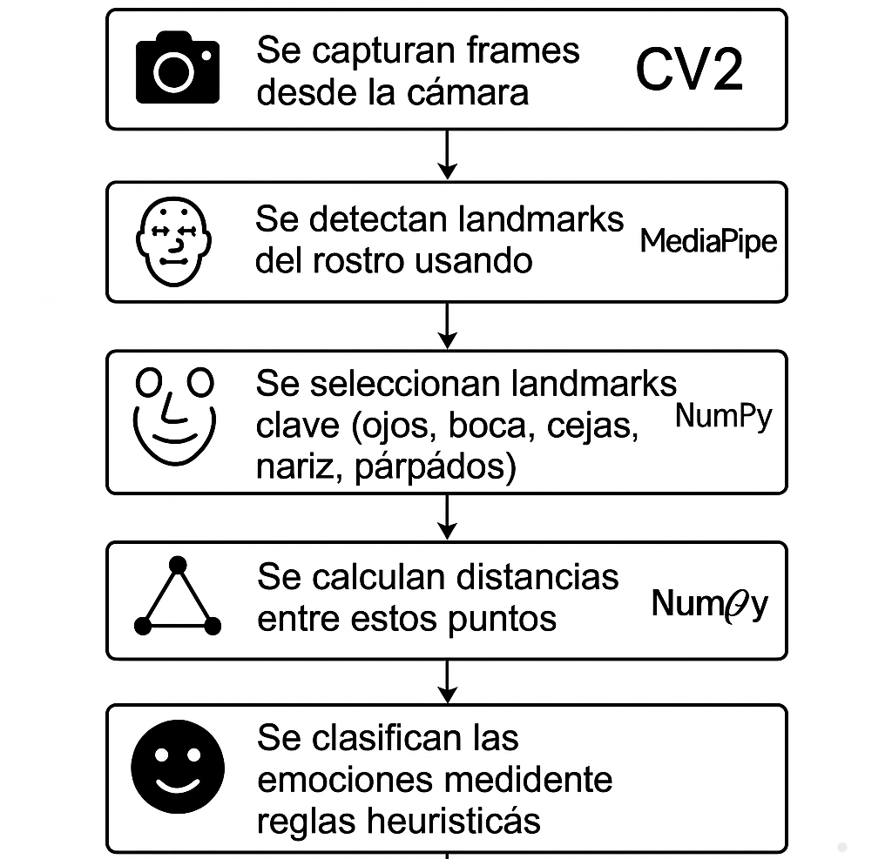
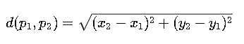
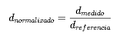

# Reconocimiento de Gestos Faciales y Emociones

## Introducción
Este código implementa un sistema de reconocimiento facial que identifica personas  y detecta emociones en tiempo real a través de una cámara web. Se utilizan técnicas geométricas sobre landmarks faciales (puntos clave del rostro) obtenidos con la herramienta **MediaPipe Face Mesh**, analizados con **OpenCV** y **NumPy** en Python.

---

## Objetivo del Proyecto
- Reconocer a personas previamente registradas mediante medidas geométricas de su rostro.
- Detectar emociones básicas (feliz, sorpresa, neutral, triste) en tiempo real (sin utilizar redes neuronales).

---

## Librerias Utilizadas

| Tecnología           | Propósito                                      |
|----------------------|-----------------------------------------------|
| MediaPipe FaceMesh   | Detección de 468 puntos faciales              |
| OpenCV               | Captura de video y visualización              |
| NumPy                | Cálculo de distancias y normalización         |
| JSON                 | Almacenamiento local de vectores faciales     |

---

## Proceso General del Programa

1. Se capturan frames desde la cámara.
2. Se detectan landmarks del rostro usando MediaPipe.
3. Se seleccionan landmarks clave (ojos, boca, cejas, nariz, párpados).
4. Se calculan distancias entre estos puntos.
5. Se **normalizan** las distancias para eliminar efectos de escala.
6. Se clasifican las emociones mediante reglas heurísticas.
7. Se compara el rostro con datos guardados para reconocer personas.

---

## Fundamentos Científicos y Matemáticos

### 1. Distancia Euclidiana

Mide la separación real entre dos puntos:

Se calcula para hacer las distancias invariantes al tamaño del rostro o distancia a la cámara.

**_d_normalizado = d_medido / d_referencia_**

Donde **d_referencia** es la distancia promedio entre los ojos.

**_referencia = (d_ojos_izq + d_ojos_der) / 2_**

**_d_boca_n = d_boca / referencia_**

Implementación en el código:

### 2. Normalización de Distancias

Mide la separación real entre dos puntos sin importar el tamaño del rostro:

Donde **_referencia = distancia promedio entre ojos._**

### 3. Elección de Landmarks

Basada en el sistema FACS (Facial Action Coding System):
* Boca (61–291): para detectar sonrisa o sorpresa.
* Cejas (105–159 / 334–386): para sorpresa, tristeza o neutralidad.
* Párpados (159–145 / 386–374): apertura ocular (neutral o sorpresa)

### 4. ¿Cómo se identifica a una persona viva?
El sistema reconoce una persona viva mediante el análisis de su rostro en tiempo real usando una cámara web.

* Detecta puntos clave del rostro (landmarks) con MediaPipe.

* Calcula distancias euclidianas entre ojos, boca y nariz.

* Compara estas medidas con registros previamente almacenados para verificar la identidad.

* El sistema solo funciona si hay movimiento facial en tiempo real, validando que la persona está viva (no una imagen estática).